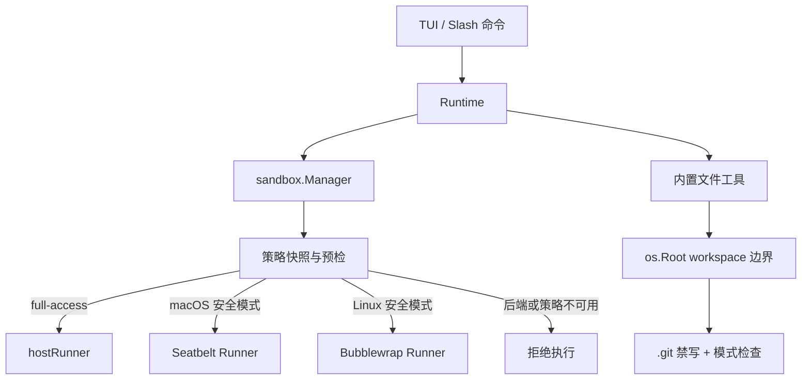
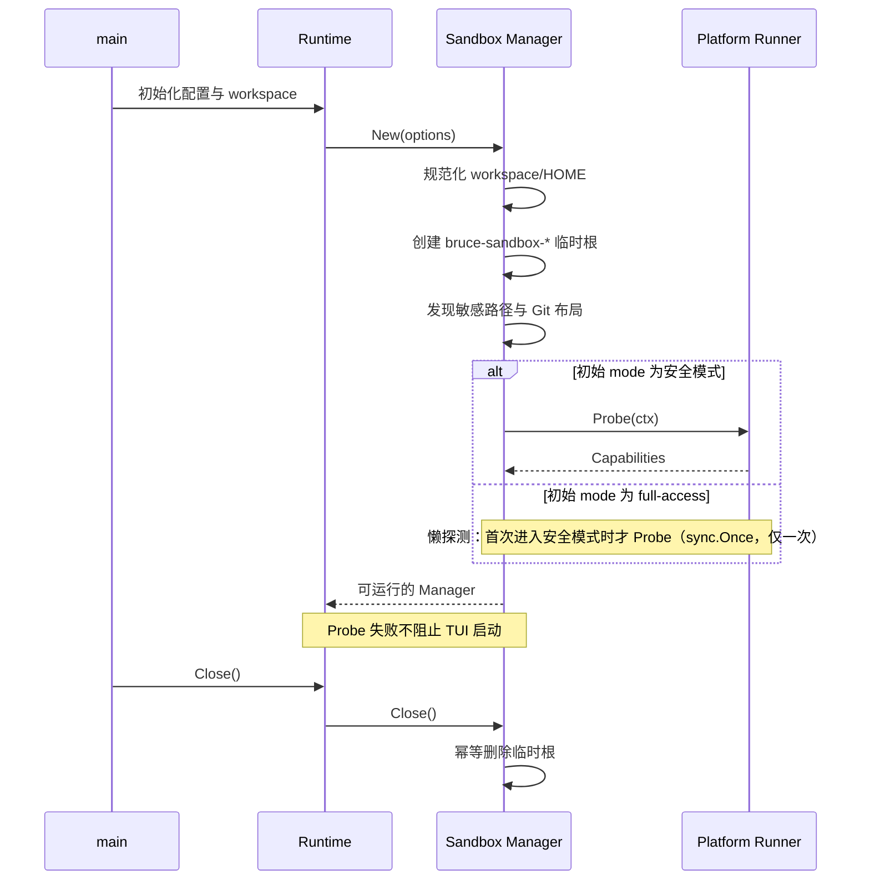
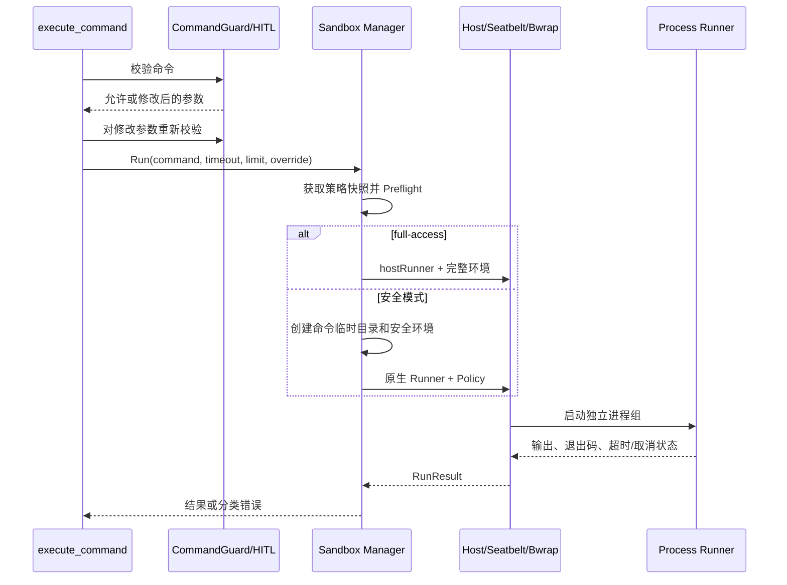

# Bruce 原生沙箱设计文档

## 文档信息

- 文档状态：当前实现基线
- 更新日期：2026-07-16
- 实现分支：`zzk/add-native-sandbox`
- 配套需求：[`sandbox-requirements.md`](sandbox-requirements.md)

## 1. 设计概述

Bruce 在 Runtime 内持有一个 `sandbox.Manager`，由 Manager 统一管理模式、网络偏好、平台能力、敏感路径、Git 布局和临时目录。Shell 命令经过 Manager 获取不可变策略快照，再被分发到宿主、Seatbelt 或 Bubblewrap Runner；内置文件工具不启动子进程，而是通过 Go `os.Root` 将所有访问限制在 workspace 内。

当前默认模式为 `full-access`。它直接走宿主 Runner，网络强制开启，不使用平台原生沙箱。`read-only` 和 `workspace-write` 才会调用 Seatbelt 或 Bubblewrap，并在后端不可用时 fail closed。



## 2. 设计原则

1. **安全模式失败关闭**：探测、策略构造或启动失败不能自动无沙箱重试。
2. **平台细节内聚**：业务层只依赖 `Runner` 和 `Manager`，不拼接 Seatbelt profile 或 Bubblewrap 参数。
3. **策略快照执行**：命令启动后不受后续 Slash 命令切换影响。
4. **纵深防御**：原生沙箱、CommandGuard、HITL、`os.Root`、输出限制和进程回收同时保留。
5. **兼容模式显式化**：`full-access` 明确表示无原生隔离，并强制显示网络开启。
6. **最小动态授权**：安全模式只授权 workspace、命令临时目录和经验证的当前 Git 元数据。
7. **可诊断但不泄密**：状态中展示后端与错误原因，错误中不包含环境变量值或凭据内容。

## 3. 模块划分

| 模块 | 责任 |
| --- | --- |
| `internal/config` | Sandbox 配置结构、默认值、mode 与 `allowedEnv` 校验 |
| `internal/sandbox/types.go` | 公共类型、模式、策略、执行结果、能力和错误定义 |
| `internal/sandbox/manager.go` | 策略状态、后端探测、环境构造、预检、命令调度和生命周期 |
| `internal/sandbox/runner_host.go` | `full-access` 宿主命令执行 |
| `internal/sandbox/runner_darwin.go` | Seatbelt profile 和 macOS Runner |
| `internal/sandbox/runner_linux.go` | Bubblewrap 探测、参数构造、挂载和 Linux Runner |
| `internal/sandbox/runner_unsupported.go` | 不支持平台的不可用实现 |
| `internal/sandbox/process*.go` | 有界输出、超时、取消和进程树回收 |
| `internal/sandbox/git_*.go` | 普通仓库与 linked worktree 布局发现和校验 |
| `internal/tool` | Shell 接入 Manager；文件工具接入 `os.Root` 与写策略 |
| `internal/integrated` | Runtime 初始化、Slash 命令、状态输出、关闭清理 |
| `internal/planning` | Plan mode 的只读策略覆盖 |
| `internal/tui` | 状态栏和层级命令补全 |

平台 Runner 使用 build tag 隔离：Darwin、Linux、unsupported 和 Unix/非 Unix 进程控制分别编译，业务层不会出现平台参数分支。

## 4. 核心类型

### 4.1 `Mode`

```go
type Mode string

const (
    ModeReadOnly       Mode = "read-only"
    ModeWorkspaceWrite Mode = "workspace-write"
    ModeFullAccess     Mode = "full-access"
)
```

`ParseMode` 是唯一模式字符串入口。旧名称 `danger-full-access` 不再兼容，避免配置和 UI 同时存在两个含义相同的值。

### 4.2 `Policy`

`Policy` 是传给 Runner 的执行时策略，包含：

- 当前模式和有效网络状态。
- 规范化后的 workspace、HOME 和当前命令临时根。
- 敏感文件目录与 Socket 路径。
- 当前仓库的 `GitLayout`。

每次执行都会复制切片和 Git 布局，Runner 不直接读取 Manager 的可变状态。

### 4.3 `CommandSpec` 与 `RunResult`

`CommandSpec` 描述命令文本、工作目录、环境、超时和最大输出字符数。`RunResult` 返回：

- 合并后的输出。
- 退出码。
- `TimedOut`。
- `Canceled`。
- `Truncated`。

策略拒绝和启动失败通过 `error` 返回；正常启动后的非零退出主要通过退出码和输出表达。

### 4.4 `Capabilities`

```go
type Capabilities struct {
    Backend   string
    Available bool
    Reason    string
}
```

能力在 Manager 初始化时探测并缓存。状态栏在 `full-access` 下仍展示探测到的平台后端，但实际命令走 `hostRunner`。

### 4.5 `Runner`

```go
type Runner interface {
    Probe(ctx context.Context) Capabilities
    Run(ctx context.Context, spec CommandSpec, policy Policy) (RunResult, error)
}
```

Runner 只负责平台探测和执行，不负责运行时模式切换。是否允许执行由 Manager 预检统一决定。

## 5. 配置设计

配置位于用户 `setting.json` 的 `sandbox` 节点：

```json
{
  "sandbox": {
    "mode": "full-access",
    "networkAccess": false,
    "allowedEnv": []
  }
}
```

配置层完成：

- 缺省值填充。
- mode 枚举校验。
- `allowedEnv` 精确变量名校验、trim 和去重。
- 启动错误传播。

Slash 命令只调用 Manager 的 setter，不修改配置对象或配置文件。

## 6. Manager 状态模型

Manager 使用 `sync.RWMutex` 保护以下可变状态：

- `mode`。
- `networkAccess` 配置偏好。
- 后端能力和策略错误的读取。

后端、workspace、HOME、敏感路径、Git 布局和临时根在初始化后保持不变。

### 6.1 网络状态

有效网络状态由下式计算：

```text
effectiveNetwork = mode == full-access || configuredNetwork
```

这样可以同时满足：

- `full-access` 永远有网络。
- 安全模式使用用户配置或 Slash 命令保存的网络偏好。
- 从 `full-access` 切回安全模式时恢复此前偏好。

`SetNetworkAccess` 只保存网络偏好：在 `full-access` 下保存 `off` 不会改变有效网络（始终开启），UI 会以 `network=开启 (配置=关闭)` 的形式展示差异，并在切换到安全模式后生效。

### 6.2 模式切换

`SetMode` 先校验枚举。目标为安全模式时，还会检查：

- 初始化阶段的策略错误。
- 原生后端能力是否可用。

目标为 `full-access` 时不依赖原生后端，因此允许在后端探测失败后切换。

### 6.3 策略快照

`Run` 首先在读锁下获取 mode、有效网络、Capabilities 和策略错误。Plan mode 可以传入 `modeOverride=read-only`。快照完成后释放锁，因此长时间命令不会阻塞状态切换，也不会被切换中的状态改变。

## 7. 初始化与关闭



Manager 的临时根由 `os.MkdirTemp` 创建，权限受当前用户控制。安全模式每条命令再创建独立的 `command-*` 子目录，其中包含 `tmp`、`cache`、`run`。命令结束立即删除子目录；Manager 关闭时删除整个运行时临时根。

`Close` 使用 `sync.Once` 保证幂等。主程序通过 `defer` 关闭 Runtime，测试也显式清理。

## 8. Shell 执行链路



### 8.1 Shell 选择

- 安全模式：`/bin/bash --noprofile --norc -c`。
- `full-access`：`/bin/bash -lc`，保持原有登录 Shell 行为。

所有平台参数都通过 `exec.Cmd.Args` 构造。用户命令只作为 Bash 的单个 `-c` 参数，不参与 Seatbelt 或 Bubblewrap 参数拼接。

### 8.2 预检

安全模式依次检查：

1. Git 或 workspace 策略是否有效。
2. 平台后端是否可用。
3. Runner 能否根据策略启动命令。

任一失败都返回 `ErrPolicy` 或 `ErrUnavailable` 包装错误。`full-access` 跳过原生策略预检。

## 9. 环境变量设计

### 9.1 安全环境允许列表

内置变量包括：

- `PATH`、`LANG`、`LC_*`。
- `TERM`、`COLORTERM`、`NO_COLOR`、`CI`。
- `USER`、`LOGNAME`、`SHELL`。
- `GOROOT`、`JAVA_HOME`、`SDKROOT`、`HOMEBREW_PREFIX`。
- 用户在 `allowedEnv` 中显式列出的名称。

Manager 遍历宿主环境，只按变量名选择，不记录或输出秘密值。

### 9.2 隔离目录重定向

每条安全命令设置：

| 变量 | 目标 |
| --- | --- |
| `TMPDIR`、`TMP`、`TEMP` | `<command-root>/tmp` |
| `XDG_CACHE_HOME` | `<command-root>/cache` |
| `XDG_RUNTIME_DIR` | `<command-root>/run` |
| `GOCACHE` | `<command-root>/cache/go-build` |
| `npm_config_cache` | `<command-root>/cache/npm` |

另外注入 `BRUCE_SANDBOX=<backend>`；网络关闭时注入 `BRUCE_SANDBOX_NETWORK_DISABLED=1`，便于子工具诊断。

`HOME` 保留真实路径以兼容只读配置发现。写权限由原生文件系统策略控制，而不是通过伪造 HOME 实现。

### 9.3 `full-access` 环境

宿主 Runner 直接使用 `os.Environ()`，不应用允许列表或缓存重定向。这是兼容模式的设计选择。

## 10. 进程与输出控制

### 10.1 有界输出

stdout 和 stderr 写入同一个 `cappedBuffer`。缓冲区在命令运行期间即限制容量，并记录是否发生截断，避免先无限占用内存再在返回时裁剪。

### 10.2 超时和取消

进程启动后：

- Unix 使用独立进程组。
- context 超时或取消时向负 PGID 发送终止信号，并补充终止主进程。
- `exec.Cmd.WaitDelay` 提供短暂等待，避免管道或残留子进程使 Wait 永久挂起。
- Bubblewrap 额外使用 `--die-with-parent`。

结果分别设置 `TimedOut` 或 `Canceled`，不会把二者混为普通非零退出。

## 11. macOS Seatbelt 设计

### 11.1 探测

Darwin Runner 固定调用 `/usr/bin/sandbox-exec`，使用最小 profile 执行 `/usr/bin/true`。失败信息存入 `Capabilities.Reason`，供状态和预检使用。

### 11.2 Profile 构造

Profile 采用静态规则骨架，动态路径通过 `-DKEY=value` 参数传递。这样可避免在 SBPL 文本中直接插入带空格、引号或 Unicode 的路径。

基础规则采用 deny-by-default 思路：

- 允许进程执行、fork、signal 和非敏感宿主只读访问。
- `read-only` 只允许命令临时目录写入。
- `workspace-write` 额外允许 workspace 与当前 Git 写根，再以更具体规则拒绝受保护路径。
- 敏感目录、凭据文件和 Socket 显式拒绝读取与写入。
- 网络只在有效网络开启时放行。
- 未列出的 Apple Events、LaunchServices、Mach Service 和 Unix Socket 保持拒绝。

Seatbelt 的 profile 与参数作为 argv 传给 `sandbox-exec`，其后执行安全 Bash。

## 12. Linux Bubblewrap 设计

### 12.1 二进制发现与信任

Runner 通过 `exec.LookPath("bwrap")` 查找系统二进制，然后：

1. 解析真实路径。
2. 拒绝位于 workspace 内的二进制。
3. 验证二进制和路径组件由 root 所有。
4. 拒绝组或其他用户可写的路径组件。

首版不捆绑二进制，也不使用 Docker 回退。

### 12.2 能力探测

Probe 启动最小 Bubblewrap 命令，验证：

- user namespace。
- PID namespace。
- IPC namespace。
- UTS namespace。
- network namespace。
- 基本 bind mount 和进程执行能力。

CI 通过 `BRUCE_REQUIRE_SANDBOX_TESTS=1` 将无法探测升级为失败，避免用 skip 掩盖环境问题。

### 12.3 挂载顺序

Bubblewrap 参数遵循由宽到窄的覆盖顺序：

1. `--ro-bind / /` 建立只读宿主根。
2. 建立最小 `/dev`、独立 `/proc`、独立 `/tmp`。
3. 绑定当前命令的临时根。
4. 以只读或可写方式重新绑定 workspace。
5. 为 `workspace-write` 绑定当前 Git 写根。
6. 覆盖 Git 受保护路径。
7. 以空目录或不可用文件遮蔽敏感路径与 Socket。
8. 清空环境并逐项设置安全环境。
9. 设置工作目录并执行安全 Bash。

网络关闭时追加 `--unshare-net`；网络开启时不隔离 network namespace，但敏感 Socket 遮蔽仍生效。

Bubblewrap 同时启用 `--unshare-user`、`--unshare-pid`、`--unshare-ipc`、`--unshare-uts`、`--new-session` 和 `--die-with-parent`。

### 12.4 敏感路径遮蔽

- 已存在目录使用空 `tmpfs` 覆盖。
- 已存在文件和 Socket 绑定为不可用文件。
- 缺失路径跳过，避免因不同主机配置导致启动失败。
- 授权和遮蔽前规范化路径，并处理软链接目标。

## 13. Git 策略设计

### 13.1 `GitLayout`

```go
type GitLayout struct {
    MarkerPath     string
    GitDir         string
    CommonDir      string
    WriteRoots     []string
    ProtectedPaths []string
}
```

发现逻辑不执行 `git` 命令，直接读取 workspace 的 `.git` 目录或指针文件，避免受仓库配置、alias、hooks 或外部可执行文件影响。

### 13.2 普通仓库

普通仓库中 `.git` 同时是 worktree gitdir 和 common dir。`workspace-write` 允许 Git 写入 refs、objects、logs、index、HEAD 和 packed refs 等常规元数据，同时保护：

- `.git/config`。
- `.git/hooks/`。
- `.git/info/`。
- `.git/objects/info/`。
- `.git/worktrees/`。

### 13.3 Linked worktree

Linked worktree 的 `.git` 是指向 common dir 下某个 `worktrees/<name>` 的文件。发现逻辑验证：

- gitdir 与 common dir 规范化后存在。
- 目录归当前 UID 所有。
- gitdir 位于 common dir 的 `worktrees` 下。
- `commondir` 与 `.git` backpointer 相互匹配当前 workspace。
- common dir 具有预期的 HEAD、objects、refs 布局。

当前 worktree gitdir 和 common dir加入写根，允许分支、index、对象、引用和日志更新。以下路径继续保护：

- 当前 `.git` marker。
- `commondir`、`gitdir`、`config.worktree`。
- common `config`、hooks、info、objects/info。
- common dir 下其他 worktree 的元数据目录。

### 13.4 非 Git workspace

没有可信 Git 布局时，不添加任何 workspace 外写根。若检测到恶意指针、所有权错误或关系不一致，则保存 `policyErr`，安全模式拒绝执行。

## 14. 内置文件工具设计

文件工具与 Shell 使用不同边界：

1. Runtime 初始化时规范化 workspace。
2. 用户传入绝对路径时，先验证其位于 workspace 内并转换为相对路径。
3. 使用 `os.OpenRoot(workspace)` 获取 Root。
4. 所有打开、创建、读取和替换操作通过 Root 完成。
5. `os.Root` 拒绝目录穿越和经目录软链接逃逸。
6. 工具层补充拒绝最终组件软链接、尾部斜杠越界和 `.git` 修改。
7. Manager 在 `read-only` 模式下通过 `CanWriteFile` 提前拒绝写工具。

`full-access` 只放宽 Shell，不放宽内置文件工具。因此即使 Shell 能直接修改任意文件，`write_file` 和 `edit_file` 仍被限制在 workspace 且不能直接修改 `.git`。

HITL 如果修改了命令或文件参数，工具必须使用修改后的参数重新执行 CommandGuard、workspace 归一化和沙箱写策略检查。

## 15. Plan mode 设计

Planning 工具注册 `execute_command` 时传入 `ModeReadOnly` 覆盖，而不是临时修改全局 Manager 模式。优点是：

- 并发的 React 命令仍可使用其正常策略。
- Plan 命令从启动到结束始终使用只读快照。
- 用户全局选择 `full-access` 也无法削弱 Plan mode 的文件系统只读约束。

Plan mode 使用 Manager 当前保存的安全网络偏好；模式覆盖只改变文件系统权限和 Runner 路径，不自动开启网络。

## 16. Slash 命令与 TUI

### 16.1 命令解析

Runtime 命令处理器识别：

```text
/sandbox [status]
/sandbox mode <read-only|workspace-write|full-access>
/sandbox network <on|off>
```

`/sandbox` 直接返回状态。mode 与 network setter 成功后也返回最新状态；失败时保留原状态并展示错误。

### 16.2 层级补全

TUI 补全器根据已输入 token 选择候选层级：

```text
/sandbox            -> status | mode | network
/sandbox mode       -> read-only | workspace-write | full-access
/sandbox network    -> on | off
```

Tab 在唯一候选时直接补全，在多个候选时展开选择列表。这样 `/sandbox` 不会被当成已完成的叶子命令。

### 16.3 状态格式

状态由 `Manager.Status()` 统一生成，包含 mode、有效 network 和 Capabilities。`/status`、`/sandbox status` 与 TUI 状态栏复用同一语义，避免出现网络偏好为关闭、但 `full-access` 实际有网络的展示冲突。

## 17. 错误模型

| 类别 | 表达方式 | 行为 |
| --- | --- | --- |
| 配置非法 | 配置加载错误 | Bruce 启动失败并提示字段原因 |
| 后端不可用 | `ErrUnavailable` + backend/reason | 安全模式拒绝；TUI 可继续运行 |
| 策略拒绝 | `ErrPolicy` + 安全原因 | 不启动命令，不降级 |
| 沙箱启动失败 | Runner 包装的启动错误 | 不重试无沙箱 |
| 命令非零退出 | `RunResult.ExitCode` | 返回命令输出和退出状态 |
| 超时 | `TimedOut=true` | 回收进程树 |
| 取消 | `Canceled=true` | 回收进程树 |
| 输出过长 | `Truncated=true` | 返回有界输出 |

错误信息可以包含路径和系统错误，但环境构造与校验不得打印变量值。

## 18. 测试与 CI 设计

### 18.1 单元测试

- 配置：默认值、非法 mode、旧 mode 拒绝、`allowedEnv` 校验和去重。
- Manager：默认 `full-access`、有效网络、模式切换、后端 fail closed、环境允许列表、宽泛 workspace、敏感 workspace、并发临时目录与幂等关闭。
- Git：普通仓库、linked worktree、恶意 `.git` 指针、错误 backpointer 和其他 worktree 保护。
- Seatbelt：SBPL 参数转义、特殊路径、网络规则和受保护路径。
- Bubblewrap：参数顺序、系统二进制信任、网络 namespace 和遮蔽规则。
- 文件工具：`..`、绝对越界、中间/最终软链接、尾部 `/`、`.git` 禁写和 HITL 参数重校验。
- TUI：Slash 命令切换、状态输出和层级 Tab 补全。

### 18.2 平台集成矩阵

Darwin 和 Linux 共用的验收语义包括：

- workspace 读取。
- `read-only` 禁止写。
- `workspace-write` 允许 workspace 写、拒绝外部写。
- 敏感凭据不可读。
- 网络关闭/开启行为。
- 网络开启时 Agent/容器 Socket 仍不可用。
- Git 常规工作流可用，受保护配置不可改。
- linked worktree 工作流和其他 worktree 隔离。
- 子孙进程继承限制并在超时/取消时退出。
- 后端失败时安全模式拒绝、`full-access` 可执行。
- Plan mode 始终只读。

### 18.3 CI

`.github/workflows/sandbox.yml` 提供 macOS 与 Ubuntu 矩阵：

- 固定 Go `1.26.5`。
- Ubuntu 显式安装 Bubblewrap。
- 设置 `BRUCE_REQUIRE_SANDBOX_TESTS=1`。
- 执行 `go test ./...`、`go test -race ./...`、`go vet ./...`。

## 19. 安全边界与权衡

### 19.1 默认兼容性与安全性的权衡

默认 `full-access` 保持既有工作流和网络体验，但意味着用户未主动切换模式时没有 Seatbelt/Bubblewrap 防护。产品和文档必须持续清晰展示这一状态，不能用“沙箱可用”误导为“当前命令已被沙箱隔离”。

### 19.2 workspace 信任边界

workspace 内容被视为用户主动交给 Agent 的任务输入，因此安全模式不会隐藏其中的 `.env`。原生沙箱主要保护 workspace 外的宿主资源，不负责 workspace 内秘密分级。

### 19.3 HOME 读取兼容性

安全模式允许读取大部分宿主配置以维持工具链可用性，同时显式遮蔽已知敏感凭据并拒绝 HOME 写入。这不是“HOME 完全不可见”，新增工具的凭据位置需要持续补充敏感路径清单。

### 19.4 网络粒度

网络是整体开关。开启后安全命令可以访问任意网络地址，只继续屏蔽已知本地 Socket；本期不提供域名或端口 allowlist。

## 20. 当前已知限制与后续方向

### 20.1 当前限制

- Git 布局和敏感路径在 Manager 初始化时快照，运行时新建仓库或改变 worktree 后不会刷新。
- 宽泛 workspace 校验当前只在以 `workspace-write` 初始化 Manager 时计算；从默认 `full-access` 动态切换时尚未重新计算。
- Linux 对初始化时不存在的受保护路径不创建占位遮蔽挂载。
- Seatbelt 是 macOS 兼容接口，其策略能力和诊断信息受系统版本影响。
- `full-access` 允许访问凭据和 Socket，不能作为安全模式使用。
- MCP、Web 工具与 Bruce 自身网络不在该 Manager 的执行边界内。

### 20.2 后续方向

- 在每次进入 `workspace-write` 前重新验证 workspace 宽度和敏感目录关系。
- 在仓库状态变化后安全刷新 GitLayout，或在每条安全命令前轻量复核。
- 增加域名/端口代理与逐命令网络授权。
- 扩展 MCP stdio 子进程的原生隔离。
- 增加 seccomp、cgroup 和资源配额。
- 评估 Windows AppContainer 或其他 Windows 原生隔离后端。

## 21. 代码索引

| 主题 | 主要文件 |
| --- | --- |
| 配置与默认值 | `internal/config/settings.go` |
| 类型与接口 | `internal/sandbox/types.go` |
| Manager 与安全环境 | `internal/sandbox/manager.go` |
| Git 布局 | `internal/sandbox/git_unix.go`、`git_other.go` |
| Seatbelt | `internal/sandbox/runner_darwin.go` |
| Bubblewrap | `internal/sandbox/runner_linux.go` |
| 宿主与不支持平台 | `internal/sandbox/runner_host.go`、`runner_unsupported.go` |
| 进程控制 | `internal/sandbox/process.go`、`process_unix.go`、`process_other.go` |
| Shell 与文件工具 | `internal/tool/tool.go` |
| Runtime 与 Slash 命令 | `internal/integrated/runtime.go` |
| Plan mode | `internal/planning/tools.go` |
| TUI 补全与状态栏 | `internal/tui/completion.go`、`internal/tui/tui.go` |
| 平台 CI | `.github/workflows/sandbox.yml` |
